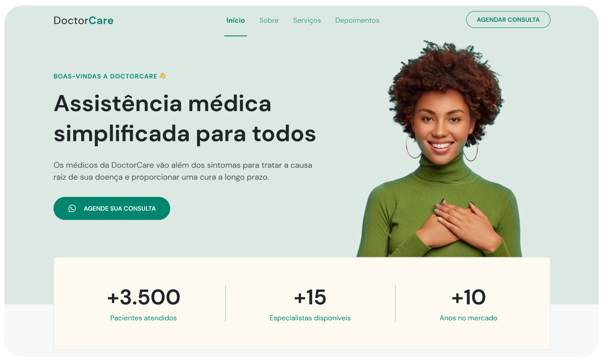

# NLW Return - Mission: Origin

 

Projeto da 8° edição da <a href="https://lp.rocketseat.com.br/nlw-return">Next Level Week</a>, evento gratuito criado pela <a href="https://www.rocketseat.com.br">Rocketseat</a>, onde construimos uma aplicação completa do zero.

 - Figma: https://www.figma.com/file/OY4dgbih23Jnj0l1GX2ddX/DoctorCare-(Community)?node-id=1716%3A251 

 - Notion: https://efficient-sloth-d85.notion.site/NLW-Return-4e1cf60ece8f42d08254810f7bb14401 

 - NLW Page: https://nextlevelweek.com/episodios/origin/aula-1/edicao/8 

### Projeto: *DoctorCare*

